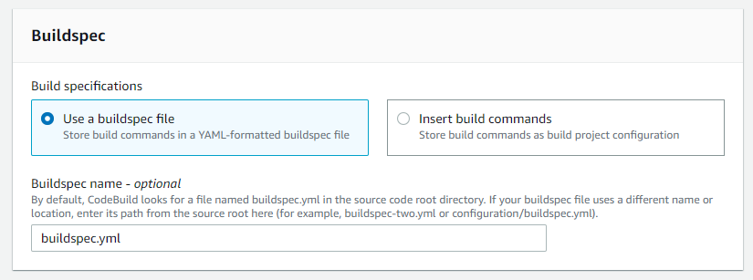

# Set up an AWS CodePipeline for CI/CD
* This document wil guide you through setting up a DevOps pipeline using AWS CodePipeline and deploying it onto AWS Elastic Beanstalk running an AWS managed Docker platform, deploying the app into a Docker container.

---

### Tech Stack
* ASP.NET Web API
* Docker
* AWS CodeBuild
* AWS CodeDeploy -> AWS Elastic Beanstalk

---

## Outline:
1. [Setup `Dockerfile`, `buildspec.yml`, & `program.cs`](#step1)
2. [Creating AWS Elastic Beanstalk](#step2)
3. [Add Source stage - Connect GitHub Repository to CodePipeline](#step3)
4. [Add Build stage - Setup AWS CodeBuild Project](#step4)
5. [Add Deploy Stage - Commit, Build Deploy!](#step5)

* Once finished, you will have a Docker application running that automatically builds your software on commit, and deploys it to the Elastic beanstalk sitting behind a load balancer for scalability. This continuous integration pipeline will allow you to worry less about your deployments and get back to focusing on feature development within your application.


---

## Setup `Dockerfile`, `buildspec.yml`, & `program.cs` <a name="step1"></a>
* Assume every file creation will be at the base of your root directory.
* Assume every file name is case sensitive.

1. Configure `program.cs` located in your API project and change the connection string to point to AWS Environment Properties (We will configure the Environment Properties at a later step)
```C#
builder.Services.AddScoped<IRepository<Pokemon>>(repo => new PokemonRepo(Environment.GetEnvironmentVariable("Connection_String")));
```
>This will break your image if you run it locally only because Environment Variables wasn't setup in the docker container. So skip this step if you want to test if your image is working first then add this step and build the image again.

2. Create a file called "Dockerfile" and write the following info:
```Dockerfile
#Getting .NET 6 runtime to just run our application
from mcr.microsoft.com/dotnet/aspnet:latest as runtime

# Setting our working directory
workdir /app

# Copying the publish folder generated by our CodeBuild
copy /publish ./

#Entrypoint to set that PokeApi.dll assembly will be our default entrypoint
entrypoint ["dotnet", "PokeApi.dll"]

#Expose to port 5000
expose 5000

#Changes the port from the runtime image to listen to 5000 (since by default it uses port 80)
env ASPNETCORE_URLS=http://+:5000
```
> ***How is the Dockerfile used?*** *The Dockerfile is a set of instructions that builds the image.* *During the **build** phase, managed by AWS CodeDeploy, we want to build an image defining the deployment environment (container) our app will run in within Elastic Beanstalk.*

***Note***: it would be good idea to test if your image is working properly first (**Only do this if you didn't do step 1 first**). Just manually create a publish folder and create the image using that folder and see if the container runs properly:
```docker run -d -p 5000:5000 [username]/[imageName]:[version]```

3. Create a file called "buildspec.yml" and write the following info:
```YML
version: 0.2

phases:
  install:
    commands:
      - echo 'Installing dotNet 6'
      - /usr/local/bin/dotnet-install.sh --channel LTS

  pre_build:
    commands:
      - echo 'Restoring dependencies and unit testing'
      - dotnet restore
      - dotnet test --no-restore
  
  build:
    commands:
      - echo 'Building the app'
      - dotnet build

  post_build:
    commands:
      - echo 'Creating Publish folder for the app'
      - dotnet publish -c Release -o publish
  
artifacts:
  files:
    - 'Dockerfile'
    - publish/**/*
```

> ***How is the `buildspec.yml` file used?*** *You can read all about why this `buildspec` file is written the way it is [here](https://docs.aws.amazon.com/codebuild/latest/userguide/getting-started-cli-create-build-spec.html) :point_left: . Since we are using another computer to build our application, this file is used to tell the computer what exactly to execute in order for us to Build, Test, and Publish our application. Artifacts is used to tell the computer what exactly to give to our Elastic Beanstalk

4. Time to `git push` it to your GitHub repository. :+1:

---
## Creating AWS Elastic Beanstalk <a name="step2"></a>
1. Go to your AWS **Management** Console and login. In the search bar, look for **Elastic Beanstalk**

2. Click **Create Application**.

<br>


3. Give your application a name.

4. Under **Platform**, choose **Docker**.

5. Under **Application code**, choose **Sample application** > Click **Create application**.

<br>


*This step will take a few minutes to set up.  You have just defined the deployment environment which is the last stage in the pipeline.  The deployed `docker image` running in the container created and run in the **post_build** stage of the CodePipeline will replace the sample application currently running in your Elastic Beanstalk environment.* <br>

*Elastic Beanstalk is an easy way to let AWS configure your EC2 instances in which the app will be deployed, and easily auto-scale your resources.*

6. Setup Environment variables to hold our connection string for our `RDS`
    * name of your Elastic Beanstalk > Configuration > Software (click the Edit button) > Environment Properties

7. Add Connection_String and the value would be the actual connection string to your `RDS` and click **Apply**

<br>


## Add Source stage - Connect GitHub Repository to CodePipeline <a name="step3"></a>

1. In the AWS search bar, search for **CodePipeline**. Click **Create pipeline**.

2. Give the pipeline a name, and click next (let it create a New service role for you).

<br>


<br>

3. **Add source stage:** Under Source provide, click **Github (Version 2)**.

4. Under **Connection** click **Connect to GitHub** > give the connection a name and click **Connect to GitHub** again in the box that pops up.

5. Click **Install a new app**, this will take you to a GitHub installer for AWS Connector.  Click on your username/organization and click **Configure**.

6. In the Repository access page, click **Only select repositories** and select your recently publiched repository containing your source code.

<br>


<br>

7. You will be brought back to the AWS popup window after you've clicked **Save** in the repository access page. There will be a number referencing the connection you just configured.  Click **Connect**.

8. You should see a message saying you're "Ready to connect".  Add the **Repository name** and `main` **branch**. These should be available as an option to select.

9. Under, **Change detection options** make sure that ***Start the pipeline on source code change*** is checked. Click Next.


> *Whenever you **Continuously Integrate** (push code to the main branch, or accept a Pull Request from a separate branch into `main` of your repository), the CodePipeline will be triggered to rebuild, test, and deploy your app whenever there's a change in the source code.*

<br>

## Add Build stage - Setup AWS CodeBuild Project <a name="step4"></a>

1. Under **Build provider**, choose **AWS CodeBuild**.

2. Under **Project name**, click **Create project**.  This will make a window pop up to configure the build job.

3. Enter a project name > make sure the box next to **Restrict number of concurrent builds this project can start** is *checked*, and **Concurrent build limit** is set to 1.

4. Under **Environment image**, click *Managed image*.

5. Under **Operating system** click *Ubuntu* > **Runtime(s)** should be *Standard*.

6. Under **Image** click `aws/codebuild/standard:5.0` 
    > *This is a Docker image that defines the Linux environment. If you're interested, you can find the actual Dockerfile that this image is built from [here](https://github.com/aws/aws-codebuild-docker-images/blob/master/ubuntu/standard/5.0/Dockerfile)*

7. :exclamation: Under **Privileged**, make sure you check the box to give your builds "elevated priveleges" to build their own Docker images.

8. Scroll down to **Buildspec** > Check *Use a buildspec file* > Under **Buildspec name** write `buildspec.yml`.

<br>




<br>

9.  Scroll down to **Logs** (this is where the logs of your build sill be stored) > give a name for both *Group name* and *Stream name*.

10. Click **Continue to CodePipeline**. You'll be brought back to the Add build stage page with a message that says *Successfully created <your-build-project> in CodeBuild* > Make sure the **Build type** is set to *Single build* and click **Next**.

<br>

## Add Deploy Stage - Commit, Build Deploy! <a name="step5"></a>

1. Under **Deploy Provider**, select *AWS ELastic Beanstalk*.

2. Select the *Application Name* of the app you set up in [Step 2](#step2) > Select the corresponding *Environment name* in the next box

3. Click **Next**.  You will be shown a summary of your CodePipeline.  Scroll to the bottom and click **Create pipeline**.

<br>

## Finished! :tada:
*Congrats! If your app deployed successfully within the pipeline, you should see the following:*

<br>


<br>

* Under **deploy** you can click on the AWS Elastic Beanstalk link which will take you to your EC2's public IPv4 address. Click that and go to your actuator end point to confirm that your app is indeed up.  You're now accessing your app via the exposed port 5000 from the docker container running within an AWS EC2 (which is auto-generated by Elastic Beanstalk.)

* Make sure you use one of the endpoints you have setuped in your controller

If you go to `http://<your-beanstalk-environment>.eba-udukpxjr.us-east-2.elasticbeanstalk.com/api/actuator/health` you should be able to see the ASP.NET endpoint showing that its status is `Severe` Mostly because the main url will not work since we didn't set it up to go to a controller's action :tada:.